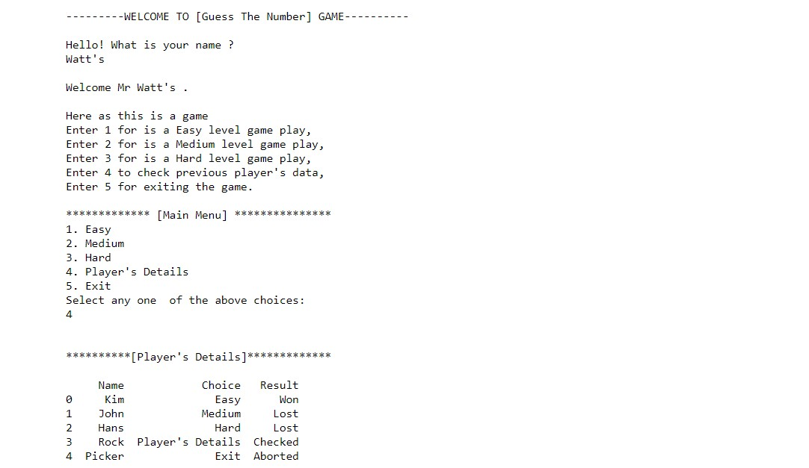
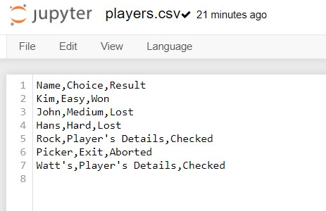

# Guess-The-Number

## This Is Actually A Game! In this game intially the player will be asked to enter his/her name and then he/she will be invited into the game. Then the computer will generate a number between the range we give starting from zero. Then the player have to guess that number in the number of given attempts. If the player guesses the number in given number of attempts he/she will to declared as a WINNER. Else if the player didn't guess the number in the given number of attempts he/she will be declared as a LOSSER. And this project has many features that wonder you. Check It Out! Thank You.

## Hope you run the code and check each and every option in the main menu.

## And in the above picture you can see that players.csv is created in the directory where the program is saved. Here you can also delete the player.csv file and it will be created again as soon as you run the code.

